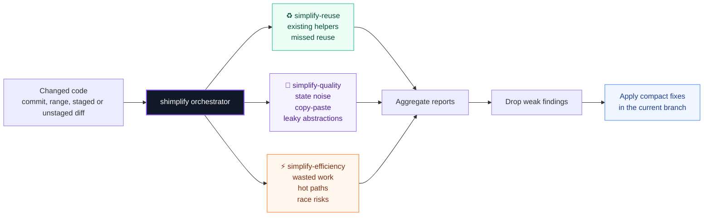
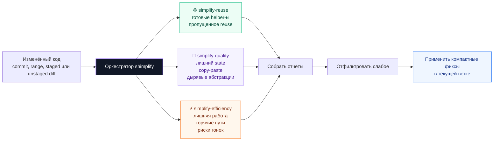
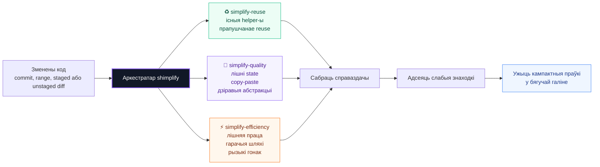

# shimplify

<p align="center">
  <b>Clean AI-generated code clutter with three focused GPT-5.5 xhigh Codex subagents.</b>
</p>

<p align="center">
  
  
  
  
  
</p>

<p align="center">
  <a href="#english">🇬🇧 English</a>
  ·
  <a href="#russian">🇷🇺 Русский</a>
  ·
  <a href="#ukrainian">🇺🇦 Українська</a>
  ·
  <a href="#belarusian">🇧🇾 Беларуская</a>
</p>

---

<a id="english"></a>

## 🇬🇧 English

`shimplify` installs a global Codex skill named `shimplify`.

It is made for code that already works, but still smells like AI-generated clutter: duplicated helpers, swollen parameters, unnecessary abstractions, repeated checks, noisy control flow, and wasted hot-path work. shimplify launches three read-only custom Codex subagents, waits for all of them, filters weak findings, and lets the main Codex agent make compact fixes in the current branch.

### ✨ What it does

| Layer | What it checks | Typical cleanup |
| --- | --- | --- |
| ♻️ Reuse | Existing helpers, local APIs, duplicated logic, repeated patterns | Less fresh code, more native repo style |
| 🧹 Quality | Redundant state, nesting, copy-paste, stringly-typed flow, leaky abstractions | Smaller, flatter, clearer code |
| ⚡ Efficiency | Wasted work, hot-path bloat, missed concurrency, TOCTOU, memory leaks | Fewer slow paths and fewer subtle bugs |

### 🧭 Review pipeline



### 🧬 Subagent roles

| Subagent | Mission | Returns |
| --- | --- | --- |
| `simplify-reuse` | Finds already-existing helpers, adapters, parsers, validators, and local patterns | Concrete reuse opportunities |
| `simplify-quality` | Finds AI-shaped complexity: extra wrappers, duplicate validation, nesting, abstraction leakage | Smaller and flatter code suggestions |
| `simplify-efficiency` | Finds repeated IO, broad scans, hot-path bloat, missed batching, and timing risks | Real work or risk to remove |

> The subagents are read-only. They do not edit files. The parent Codex agent waits for every report, accepts only useful findings, and performs the final edits.

### 📥 Install

**Universal install.** If you already have Node.js/npm, this one command works on macOS, Windows, and Linux:

```bash
npx -y shimplify
```

**Platform bootstrap.** Use these when you want to fetch the installer directly:

Directly from GitHub:

```bash
npx -y github:kirillshsh/shimplify
```

macOS / Linux bootstrap:

```bash
curl -fsSL https://raw.githubusercontent.com/kirillshsh/shimplify/main/install.sh | bash
```

Windows PowerShell bootstrap:

```powershell
irm https://raw.githubusercontent.com/kirillshsh/shimplify/main/install.ps1 | iex
```

Restart Codex after installation so the new custom agents are loaded.

### 📦 Installed files

| File | Purpose |
| --- | --- |
| `~/.codex/skills/shimplify` | Global `shimplify` skill |
| `~/.codex/agents/simplify-reuse.toml` | GPT-5.5 xhigh reuse reviewer |
| `~/.codex/agents/simplify-quality.toml` | GPT-5.5 xhigh quality reviewer |
| `~/.codex/agents/simplify-efficiency.toml` | GPT-5.5 xhigh efficiency reviewer |
| `~/.codex/config.toml` | Adds `[agents.simplify-reuse]`, `[agents.simplify-quality]`, and `[agents.simplify-efficiency]` |

### 💬 How to call it

| Surface | Trigger | What to add after it |
| --- | --- | --- |
| Codex CLI | `$shimplify` | What to clean up, a file/scope, a commit SHA, or a diff range |
| Codex App | `/shimplify` | What to clean up, a file/scope, a commit SHA, or a diff range |

```text
$shimplify clean up the current unstaged diff
$shimplify 773a27074249e26b53159110a008156230f6e3a6b4255c574e253738ea5432b3
/shimplify clean up the checkout flow
/shimplify HEAD~3..HEAD
```

<details>
<summary><b>Advanced install options</b></summary>

```bash
CODEX_HOME="$HOME/.codex" npx -y shimplify
CODEX_SKILLS_DIR="$HOME/.codex/skills" npx -y shimplify
npx -y shimplify --legacy-agents-dir
```

| Flag | Meaning |
| --- | --- |
| `--codex-home <path>` | Override Codex config directory |
| `--skills-dir <path>` | Override skill install directory |
| `--legacy-agents-dir` | Install the skill to `~/.agents/skills` instead |

</details>

---

<a id="russian"></a>

## 🇷🇺 Русский

`shimplify` ставит глобальный Codex skill `shimplify`.

Он нужен для кода, который уже работает, но всё ещё выглядит как мусорный код после ИИ: дублирующие helper-ы, распухшие параметры, лишние абстракции, повторные проверки, шумный control flow и лишняя работа в hot path. shimplify запускает три read-only custom subagent-а Codex, ждёт все результаты, отбрасывает слабые findings и даёт верхнему Codex-agent-у применить компактные правки прямо в текущей ветке.

### ✨ Что он делает

| Слой | Что проверяет | Типичная чистка |
| --- | --- | --- |
| ♻️ Переиспользование | Существующие helper-ы, локальные API, дублирующая логика, повторяющиеся паттерны | Меньше нового кода, больше стиля самого repo |
| 🧹 Качество | Лишний state, вложенность, copy-paste, stringly-typed flow, протекающие абстракции | Код становится меньше, проще и прямее |
| ⚡ Эффективность | Лишняя работа, hot-path bloat, missed concurrency, TOCTOU, утечки памяти | Меньше медленных путей и скрытых багов |

### 🧭 Схема проверки



### 🧬 Роли subagent-ов

| Subagent | Задача | Что возвращает |
| --- | --- | --- |
| `simplify-reuse` | Ищет уже существующие helper-ы, адаптеры, parser-ы, validator-ы и локальные паттерны | Конкретные возможности reuse |
| `simplify-quality` | Ищет ИИ-шум: лишние wrappers, duplicate validation, вложенность, abstraction leakage | Что можно сделать меньше и прямее |
| `simplify-efficiency` | Ищет повторный IO, широкие scans, hot-path bloat, missed batching и timing-риск | Реальную лишнюю работу или риск |

> Subagent-ы read-only. Они не меняют файлы. Главный Codex-agent ждёт все отчёты, берёт только полезные findings и сам делает финальные правки.

### 📥 Установка

**Универсальная установка.** Если уже есть Node.js/npm, эта одна команда работает на macOS, Windows и Linux:

```bash
npx -y shimplify
```

**Установка по платформам.** Эти варианты подтягивают installer напрямую:

Напрямую с GitHub:

```bash
npx -y github:kirillshsh/shimplify
```

macOS / Linux:

```bash
curl -fsSL https://raw.githubusercontent.com/kirillshsh/shimplify/main/install.sh | bash
```

Windows PowerShell:

```powershell
irm https://raw.githubusercontent.com/kirillshsh/shimplify/main/install.ps1 | iex
```

После установки перезапусти Codex, чтобы он подхватил новых custom agent-ов.

### 📦 Что ставится

| Файл | Для чего |
| --- | --- |
| `~/.codex/skills/shimplify` | Глобальный skill `shimplify` |
| `~/.codex/agents/simplify-reuse.toml` | Reuse-reviewer на GPT-5.5 xhigh |
| `~/.codex/agents/simplify-quality.toml` | Quality-reviewer на GPT-5.5 xhigh |
| `~/.codex/agents/simplify-efficiency.toml` | Efficiency-reviewer на GPT-5.5 xhigh |
| `~/.codex/config.toml` | Добавляет `[agents.simplify-reuse]`, `[agents.simplify-quality]` и `[agents.simplify-efficiency]` |

### 💬 Как вызвать

| Где | Команда | Что писать дальше |
| --- | --- | --- |
| Codex CLI | `$shimplify` | Что упростить, файл/область, commit SHA или diff range |
| Codex App | `/shimplify` | Что упростить, файл/область, commit SHA или diff range |

```text
$shimplify упрости текущий unstaged diff
$shimplify 773a27074249e26b53159110a008156230f6e3a6b4255c574e253738ea5432b3
/shimplify подчисти checkout flow
/shimplify HEAD~3..HEAD
```

<details>
<summary><b>Кастомные пути и флаги</b></summary>

```bash
CODEX_HOME="$HOME/.codex" npx -y shimplify
CODEX_SKILLS_DIR="$HOME/.codex/skills" npx -y shimplify
npx -y shimplify --legacy-agents-dir
```

| Флаг | Значение |
| --- | --- |
| `--codex-home <path>` | Переопределить папку Codex config |
| `--skills-dir <path>` | Переопределить папку установки skill-а |
| `--legacy-agents-dir` | Поставить skill в `~/.agents/skills` |

</details>

---

<a id="ukrainian"></a>

## 🇺🇦 Українська

`shimplify` встановлює глобальний Codex skill `shimplify`.

Він потрібен для коду, який уже працює, але ще виглядає як типовий результат ШІ: дубльовані helper-и, роздуті параметри, зайві абстракції, повторні перевірки, шумний control flow і зайва робота в гарячих шляхах. shimplify запускає три read-only custom subagent-и Codex, чекає всі результати, відсіює слабкі знахідки й дає головному Codex-agent-у застосувати компактні правки в поточній гілці.

### ✨ Що він робить

| Шар | Що перевіряє | Типове очищення |
| --- | --- | --- |
| ♻️ Повторне використання | Наявні helper-и, локальні API, дубльована логіка, повторювані патерни | Менше нового коду, більше стилю самого repo |
| 🧹 Якість | Зайвий state, вкладеність, copy-paste, stringly-typed flow, протікання абстракцій | Менший, пласкіший і зрозуміліший код |
| ⚡ Ефективність | Зайва робота, hot-path bloat, пропущена конкурентність, TOCTOU, витоки пам'яті | Менше повільних шляхів і прихованих багів |

### 🧭 Схема перевірки


### 🧬 Ролі subagent-ів

| Subagent | Завдання | Що повертає |
| --- | --- | --- |
| `simplify-reuse` | Шукає вже наявні helper-и, адаптери, parser-и, validator-и й локальні патерни | Конкретні можливості reuse |
| `simplify-quality` | Шукає ШІ-шум: зайві wrappers, duplicate validation, вкладеність, abstraction leakage | Що можна зробити меншим і прямішим |
| `simplify-efficiency` | Шукає повторний IO, широкі scans, hot-path bloat, missed batching і timing-ризик | Реальну зайву роботу або ризик |

> Subagent-и read-only. Вони не змінюють файли. Головний Codex-agent чекає всі звіти, бере тільки корисні знахідки й сам робить фінальні правки.

### 📥 Встановлення

**Універсальне встановлення.** Якщо вже є Node.js/npm, ця одна команда працює на macOS, Windows і Linux:

```bash
npx -y shimplify
```

**Встановлення за платформами.** Ці варіанти підтягують installer напряму:

Напряму з GitHub:

```bash
npx -y github:kirillshsh/shimplify
```

macOS / Linux:

```bash
curl -fsSL https://raw.githubusercontent.com/kirillshsh/shimplify/main/install.sh | bash
```

Windows PowerShell:

```powershell
irm https://raw.githubusercontent.com/kirillshsh/shimplify/main/install.ps1 | iex
```

Після встановлення перезапусти Codex, щоб він підхопив нових custom agent-ів.

### 📦 Що встановлюється

| Файл | Для чого |
| --- | --- |
| `~/.codex/skills/shimplify` | Глобальний skill `shimplify` |
| `~/.codex/agents/simplify-reuse.toml` | Reuse-reviewer на GPT-5.5 xhigh |
| `~/.codex/agents/simplify-quality.toml` | Quality-reviewer на GPT-5.5 xhigh |
| `~/.codex/agents/simplify-efficiency.toml` | Efficiency-reviewer на GPT-5.5 xhigh |
| `~/.codex/config.toml` | Додає `[agents.simplify-reuse]`, `[agents.simplify-quality]` і `[agents.simplify-efficiency]` |

### 💬 Як викликати

| Де | Команда | Що писати далі |
| --- | --- | --- |
| Codex CLI | `$shimplify` | Що спростити, файл/область, commit SHA або diff range |
| Codex App | `/shimplify` | Що спростити, файл/область, commit SHA або diff range |

```text
$shimplify спростити поточний unstaged diff
$shimplify 773a27074249e26b53159110a008156230f6e3a6b4255c574e253738ea5432b3
/shimplify почистити checkout flow
/shimplify HEAD~3..HEAD
```

<details>
<summary><b>Кастомні шляхи й прапорці</b></summary>

```bash
CODEX_HOME="$HOME/.codex" npx -y shimplify
CODEX_SKILLS_DIR="$HOME/.codex/skills" npx -y shimplify
npx -y shimplify --legacy-agents-dir
```

| Прапорець | Значення |
| --- | --- |
| `--codex-home <path>` | Перевизначити папку Codex config |
| `--skills-dir <path>` | Перевизначити папку встановлення skill-а |
| `--legacy-agents-dir` | Встановити skill у `~/.agents/skills` |

</details>

---

<a id="belarusian"></a>

## 🇧🇾 Беларуская

`shimplify` усталёўвае глабальны Codex skill `shimplify`.

Ён патрэбны для кода, які ўжо працуе, але ўсё яшчэ выглядае як тыповы вынік ШІ: дубляваныя helper-ы, раздзьмутыя параметры, лішнія абстракцыі, паўторныя праверкі, шумны control flow і лішняя праца ў гарачых шляхах. shimplify запускае тры read-only custom subagent-ы Codex, чакае ўсе вынікі, адкідвае слабыя знаходкі і дае галоўнаму Codex-agent-у ўжыць кампактныя праўкі ў бягучай галіне.

### ✨ Што ён робіць

| Слой | Што правярае | Тыповая чыстка |
| --- | --- | --- |
| ♻️ Паўторнае выкарыстанне | Існыя helper-ы, лакальныя API, дубляваная логіка, паўторныя патэрны | Менш новага кода, больш стылю самога repo |
| 🧹 Якасць | Лішні state, укладзенасць, copy-paste, stringly-typed flow, дзіравыя абстракцыі | Меншы, больш плоскі і ясны код |
| ⚡ Эфектыўнасць | Лішняя праца, hot-path bloat, прапушчаная канкурэнтнасць, TOCTOU, уцечкі памяці | Менш павольных шляхоў і схаваных багаў |

### 🧭 Схема праверкі



### 🧬 Ролі subagent-аў

| Subagent | Задача | Што вяртае |
| --- | --- | --- |
| `simplify-reuse` | Шукае ўжо існыя helper-ы, адаптары, parser-ы, validator-ы і лакальныя патэрны | Канкрэтныя магчымасці reuse |
| `simplify-quality` | Шукае ШІ-шум: лішнія wrappers, duplicate validation, укладзенасць, abstraction leakage | Што можна зрабіць меншым і прамейшым |
| `simplify-efficiency` | Шукае паўторны IO, шырокія scans, hot-path bloat, missed batching і timing-рызыку | Рэальную лішнюю працу або рызыку |

> Subagent-ы read-only. Яны не змяняюць файлы. Галоўны Codex-agent чакае ўсе справаздачы, бярэ толькі карысныя знаходкі і сам робіць фінальныя праўкі.

### 📥 Усталяванне

**Універсальнае ўсталяванне.** Калі ўжо ёсць Node.js/npm, гэта адна каманда працуе на macOS, Windows і Linux:

```bash
npx -y shimplify
```

**Усталяванне па платформах.** Гэтыя варыянты падцягваюць installer напрамую:

Напрамую з GitHub:

```bash
npx -y github:kirillshsh/shimplify
```

macOS / Linux:

```bash
curl -fsSL https://raw.githubusercontent.com/kirillshsh/shimplify/main/install.sh | bash
```

Windows PowerShell:

```powershell
irm https://raw.githubusercontent.com/kirillshsh/shimplify/main/install.ps1 | iex
```

Пасля ўсталявання перазапусці Codex, каб ён падхапіў новых custom agent-аў.

### 📦 Што ўсталёўваецца

| Файл | Для чаго |
| --- | --- |
| `~/.codex/skills/shimplify` | Глабальны skill `shimplify` |
| `~/.codex/agents/simplify-reuse.toml` | Reuse-reviewer на GPT-5.5 xhigh |
| `~/.codex/agents/simplify-quality.toml` | Quality-reviewer на GPT-5.5 xhigh |
| `~/.codex/agents/simplify-efficiency.toml` | Efficiency-reviewer на GPT-5.5 xhigh |
| `~/.codex/config.toml` | Дадае `[agents.simplify-reuse]`, `[agents.simplify-quality]` і `[agents.simplify-efficiency]` |

### 💬 Як выклікаць

| Дзе | Каманда | Што пісаць далей |
| --- | --- | --- |
| Codex CLI | `$shimplify` | Што спрасціць, файл/вобласць, commit SHA або diff range |
| Codex App | `/shimplify` | Што спрасціць, файл/вобласць, commit SHA або diff range |

```text
$shimplify спрасціць бягучы unstaged diff
$shimplify 773a27074249e26b53159110a008156230f6e3a6b4255c574e253738ea5432b3
/shimplify пачысціць checkout flow
/shimplify HEAD~3..HEAD
```

<details>
<summary><b>Кастомныя шляхі і флагі</b></summary>

```bash
CODEX_HOME="$HOME/.codex" npx -y shimplify
CODEX_SKILLS_DIR="$HOME/.codex/skills" npx -y shimplify
npx -y shimplify --legacy-agents-dir
```

| Флаг | Значэнне |
| --- | --- |
| `--codex-home <path>` | Перавызначыць папку Codex config |
| `--skills-dir <path>` | Перавызначыць папку ўсталявання skill-а |
| `--legacy-agents-dir` | Усталяваць skill у `~/.agents/skills` |

</details>
